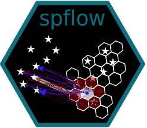

<!-- README.md is generated from README.Rmd. Please edit that file -->

# spflow <a href="https://lukece.github.io/spflow/"></a>

<!-- badges: start -->

[](https://CRAN.R-project.org/package=spflow)
[](https://github.com/LukeCe/spflow/actions)
[](https://github.com/LukeCe/spflow/actions)
[](https://CRAN.R-project.org/package=spflow)
[](https://www.r-pkg.org/pkg/spflow)
<!-- badges: end -->

The [**spflow**](https://lukece.github.io/spflow/) package allows to
estimate spatial econometric interaction models. It is designed to
exploit the relational structure of flow data, reducing the
computational burden and memory requirements.

## Installation

You can install the released version of spflow from
[CRAN](https://CRAN.R-project.org/package=spflow) with:

``` r
install.packages("spflow")
```

And the development version from
[GitHub](https://github.com/LukeCe/spflow/) with:

``` r
# install.packages("devtools")
devtools::install_github("LukeCe/spflow@non-cartesian-flows")
```

## Example

The package provides a new `spflow_network_multi-class` that combines
information on the origins, the destinations, and the origin-destination
pairs. Once this object is created, we can estimate an interaction model
with the `spflow()` function. By default the model includes three
autoregression parameters: rho_o, rho_d, rho_w. These parameters are
related to origin-, destination-, and origin-to-destination-dependence.

Through the formula interface we specify which variables are used as
origin `O_()`, destination `D_()`, intra-regional `I_()` and OD-pair
`P_()` characteristics.

For more detailed examples have a look at the [package
vignette](https://lukece.github.io/spflow/articles/paris_commute_flows.html).

``` r
library("spflow")
data("multi_net_usa_ge")

spflow(y9 ~ O_(X) + D_(X) + I(X) + P_(DISTANCE), multi_net_usa_ge)
#> --------------------------------------------------
#> Spatial interaction model estimated by: MLE  
#> Spatial correlation structure: SDM (model_9)
#> Dependent variable: y9
#> 
#> --------------------------------------------------
#> Coefficients:
#>                 est     sd   t.stat  p.val
#> rho_d         0.497  0.030   16.499      0
#> rho_o         0.333  0.037    9.001      0
#> rho_w        -0.227  0.044   -5.117      0
#> (Intercept)  10.198  2.161    4.719      0
#> (Intra)       9.871  1.531    6.445      0
#> D_X           0.983  0.069   14.321      0
#> D_X.lag1      0.509  0.115    4.437      0
#> O_X          -0.759  0.038  -19.917      0
#> O_X.lag1     -0.367  0.093   -3.965      0
#> I_I(X)        2.035  0.083   24.650      0
#> P_DISTANCE   -2.622  0.384   -6.829      0
#> 
#> --------------------------------------------------
#> R2_corr: 0.9921423  
#> Observations: 256  
#> Model coherence: Validated
```

## License

[GPL 3](https://www.r-project.org/Licenses/GPL-3)
